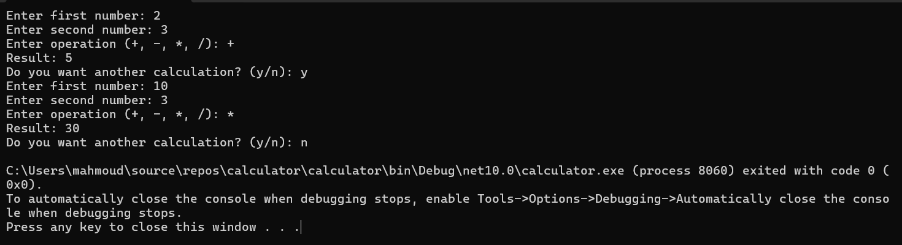

# Calculator

A simple calculator application built using C# and .NET.

## Features

- Addition
- Subtraction
- Multiplication
- Division
- Input validation
- Division by zero handling
- Multiple calculations without restarting the application

## Technologies

- C#
- .NET

## How to Run

1. Clone the repository.
2. Open the project in Visual Studio.
3. Run the application.

## Screenshot

